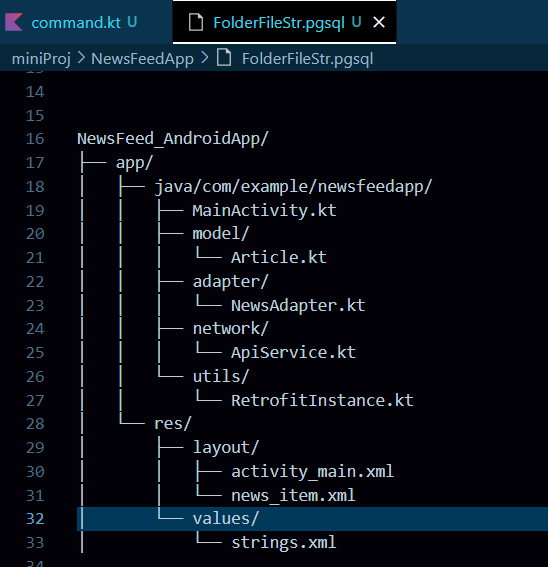

# 📰 NewsFeed Android App

A simple Android application that fetches and displays news articles in a scrollable list using RecyclerView.

## 📱 Features
- Displays a list of news articles with:
  - Title
  - Description
  - Image
- Asynchronous data fetching (using Coroutine or AsyncTask)
- Glide library for image loading
- Loading indicator while fetching data
- Responsive and scrollable UI

## 🚀 Tech Stack
- Kotlin
- Android SDK
- RecyclerView
- Glide
- Coroutines (or AsyncTask)


## 📂 Folder Structure




<!-- here we used img for files structure -->

## 🛠️ Project Setup Screenshot

The project was initialized in Android Studio using the following settings:


<!-- here we diectly access img from my github page URL but not locally from this Laptop relative path  -->


## 🔑 Get Your API Key

1. Visit [https://newsapi.org](https://newsapi.org)
2. Sign up for a free account
3. Copy your API key
4. Replace it in `ApiService.kt`:
   ```kotlin
   @GET("v2/top-headlines?country=us&apiKey=YOUR_API_KEY")

<br> <br>

## 📦 Dependencies

Add the following to your `app/build.gradle` file:

```gradle
// RecyclerView
implementation 'androidx.recyclerview:recyclerview:1.3.1'

// Glide for image loading
implementation 'com.github.bumptech.glide:glide:4.15.1'
kapt 'com.github.bumptech.glide:compiler:4.15.1'
```


### 📱 Emulator Setup
- **Android Virtual Device (AVD)**:  
  - Android 11 (API 30) or higher  
  - Minimum 2 GB RAM allocated to emulator  
  - x86_64 image (for better performance with hardware acceleration)


<br>

## Thanks & Happy AndroidAppDev !